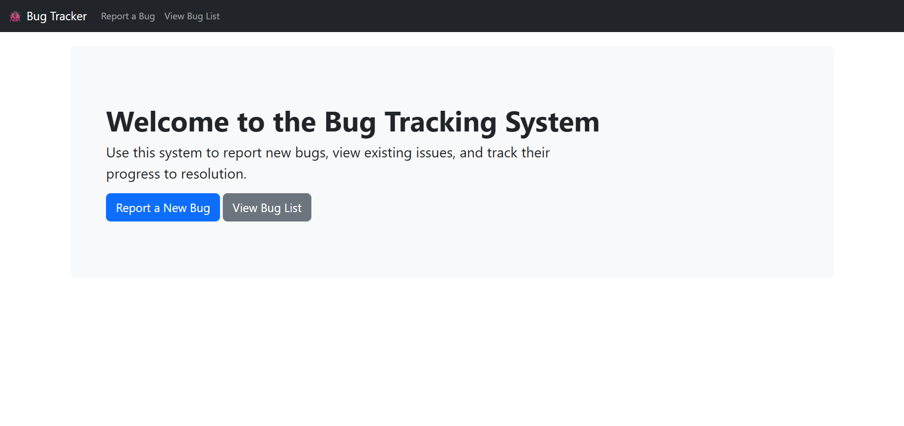
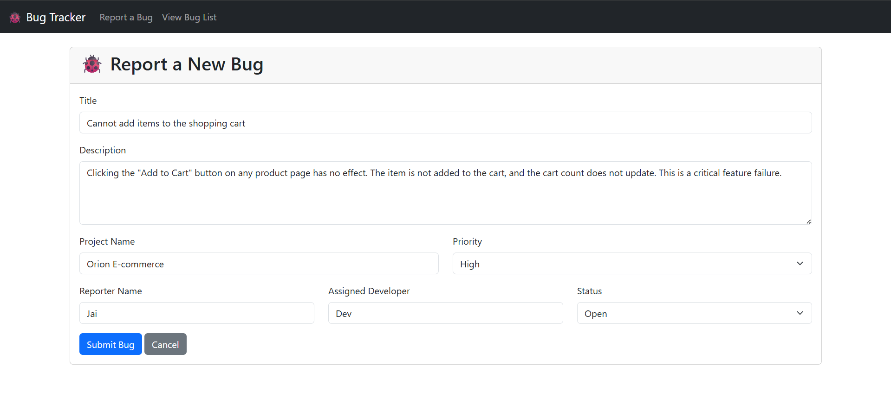
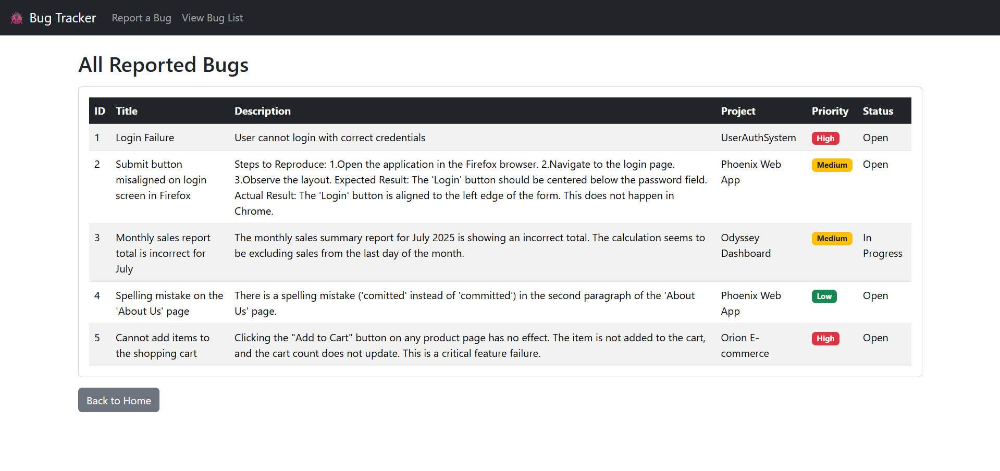

# 🐞 Bug Tracking System

A complete web application built with Java, Spring Boot, and Thymeleaf for reporting and tracking software bugs. This project allows users to submit detailed bug reports through a web form and view a comprehensive list of all submitted bugs in a styled, responsive interface.

---

## ✨ Features

* **Report Bugs:** A user-friendly form to submit new bug reports with details such as Title, Description, Project Name, Priority, Status, Reporter, and Assigned Developer.
* **View Bug List:** A clean, organized table that displays all reported bugs with color-coded priority badges.
* **Styled UI:** A modern and responsive user interface built with the Bootstrap framework.
* **Backend Logic:** Powered by Spring Boot to handle web requests and manage data.

---

## 🛠️ Tech Stack

* **Backend:** Java 17+, Spring Boot, Spring Web (MVC)
* **Frontend:** Thymeleaf, HTML5, Bootstrap 5
* **Database:** MySQL
* **Build Tool:** Maven

---

## 🚀 Getting Started

To get a local copy up and running, follow these simple steps.

### Prerequisites

You need to have the following software installed on your machine:
* Java Development Kit (JDK) 17 or later
* Apache Maven
* MySQL Server (and a client like MySQL Workbench)
* An IDE like IntelliJ IDEA or VS Code

### Installation & Setup

1.  **Clone the repository:**
    ```bash
    git clone [https://github.com/Neerajakakunuri-12/Bug-Tracking-System.git](https://github.com/Neerajakakunuri-12/Bug-Tracking-System.git)
    ```

2.  **Navigate to the project directory:**
    ```bash
    cd Bug-Tracking-System
    ```

3.  **Setup the Database:**
    * Make sure your MySQL server is running.
    * Create a new database schema (e.g., `bugtracker_db`).
    * The repository may contain a `.sql` file to create the `bug_reports` table. If so, run that script in your new database schema.

4.  **Configure the Application:**
    * Open the `src/main/resources/application.properties` file.
    * **Important:** Right now, the project is configured to exclude the database connection. To connect to your MySQL database in the future, you would update this file with your database URL, username, and password like this:
        ```properties
        # spring.datasource.url=jdbc:mysql://localhost:3306/bugtracker_db
        # spring.datasource.username=your_mysql_username
        # spring.datasource.password=your_mysql_password
        # spring.jpa.hibernate.ddl-auto=update
        ```

5.  **Build and Run:**
    * Build the project using Maven: `mvn clean install`
    * Run the application: `mvn spring-boot:run` (or by running the `BugtrackerApplication.java` file from your IDE).

6.  **Access the application:**
    * Open your web browser and navigate to `http://localhost:8080`

---
## 🗂 Database Table Structure

The application is designed to work with the following table structure in MySQL.

**Table name: `bug_reports`**

| Column Name      | Data Type                         |
| ---------------- | --------------------------------- |
| `bug_id`         | INT (AUTO_INCREMENT, PRIMARY KEY) |
| `title`          | VARCHAR(100)                      |
| `description`    | TEXT                              |
| `project_name`   | VARCHAR(100)                      |
| `priority`       | VARCHAR(50)                       |
| `status`         | VARCHAR(50)                       |
| `reporter_name`  | VARCHAR(100)                      |
| `developer_name` | VARCHAR(100)                      |
| `date_reported`  | TIMESTAMP DEFAULT CURRENT_TIMESTAMP |

---

## 📸 Screenshots


**Homepage:**


**Bug Report Form:**


**Bug List:**


---
## 📌 Future Improvements

-   [ ] Fully connect the application to the MySQL database using Spring Data JPA.
-   [ ] Implement bug editing and deleting functionality.
-   [ ] Add a user authentication system for reporters and developers.
-   [ ] Implement filtering and sorting for the bug list.

## 📬 Contact

If you liked this project or have suggestions, feel free to connect with me on [LinkedIn](https://www.linkedin.com/in/kakunuri-neeraja-534602251) or fork this repo!

